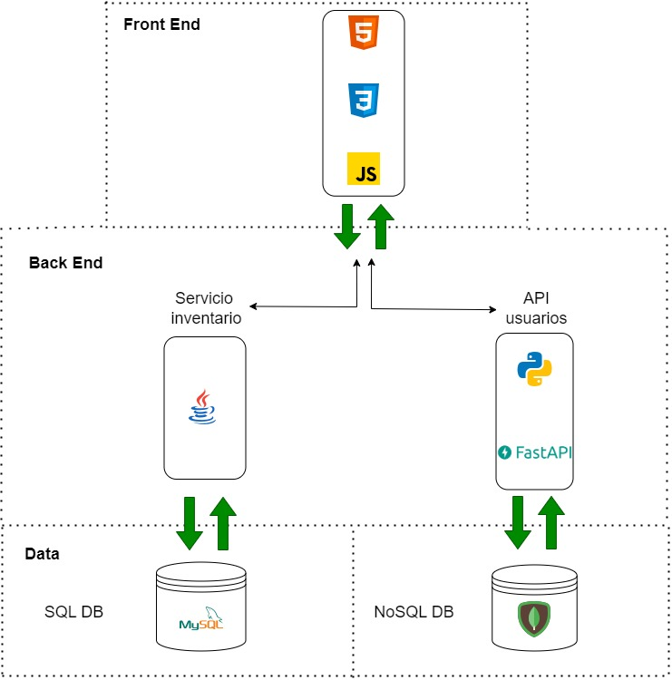

# Inventory project

Este es el repositorio de los requerimientos y el desarrollo del
proyecto de inventario sistema MGM.

El sistema de archivos es

```bash
├── assets
│   └── docs
│       ├── trim1
│       │   ├── 1_gestion_proyecto
│       │   ├── 2_levantamiento_informacion
│       │   ├── 3_diagrama_procesos
│       │   ├── 4_requisitos_software
│       │   ├── 5_diagrama_casos_uso
│       │   ├── 6_casos_uso_extendido
│       │   ├── 7_diagrama_clases
│       │   └── 9_arquitectura_software
│       ├── trim2
│       │   ├── 1_mer
│       │   ├── 2_mr
│       │   ├── 3_diccionario_datos
│       │   ├── 4_bbdd
│       │   ├── 5_ddl
│       │   ├── 6_dml
│       ├── trim3
│       │   ├── 1_planeacion_pruebas
│       │   └── 2_ejecucion_pruebas
│       ├── trim4
│       │   └── plan_despliegue
│       └── trim5
├── backend
│   ├── proyectoGinnaMarcela
│   └── users-module
└── frontend
    └── sistema_inventario
```

La arquitectura inicial del proyecto distribuye al backend y al frontend de la siguiente manera:



## Backend

* El módulo que gestiona a los usuarios y su atenticación en el sistema (con JWT) usa el framework [Fast API](https://fastapi.tiangolo.com/) y MongoBD como base de datos.
* El modulo que gestiona los productos usa el framework [Springboot](https://spring.io/projects/spring-boot)

Se esta usando [Github actions](https://docs.github.com/en/actions/quickstart) como CI/CD [aqui](https://github.com/dzarkV/TPS_FDS_2671339_PMGM6/actions/runs/6177413671/workflow). El servicio de inventarios y el frontend son contenerizados y enviados a regitro de imágenes en el flujo.

## Frontend

Se construyó usando HTML, CSS y Javascript Vanilla. Se consume con fetch las APIs de los microservicios desde el frontend.

## Tests

Las pruebas unitarias del módulo de usuarios usan la técnica mock para no involucrar a la base de datos. Están configurados en el archivo de workflow `yml` de Github Actions, y ejecutados dentro de un flujo de trabajo (workflow) de integración continua. [Aquí un ejemplo](./assets/docs/trim3/2_ejecucion_pruebas/pruebas-unitarias-usuarios.png) para la construcción y la ejecución de pruebas unitarios antes del despligue.

También se configuró un workflow para realizar las pruebas a la API del servicio de usuarios con Postman CLI [aquí](.github/workflows/Automated_API_tests_using_Postman_CLI.yml).

## Despliegue

Se definió un plan de despliegue [aquí](./assets/docs/trim4/plan_despligue.md) con la herramienta de infraestructura como código [terraform](https://www.terraform.io/) para el aprovisionamiento de los recursos necesarios para el sistema en la nube de Azure.

[Aquí](https://guardarcosasdelsena.blob.core.windows.net/cosas-del-sena/plan_despliegue.mp4) el video de instalación con las configuraciones definidas en el plan.
